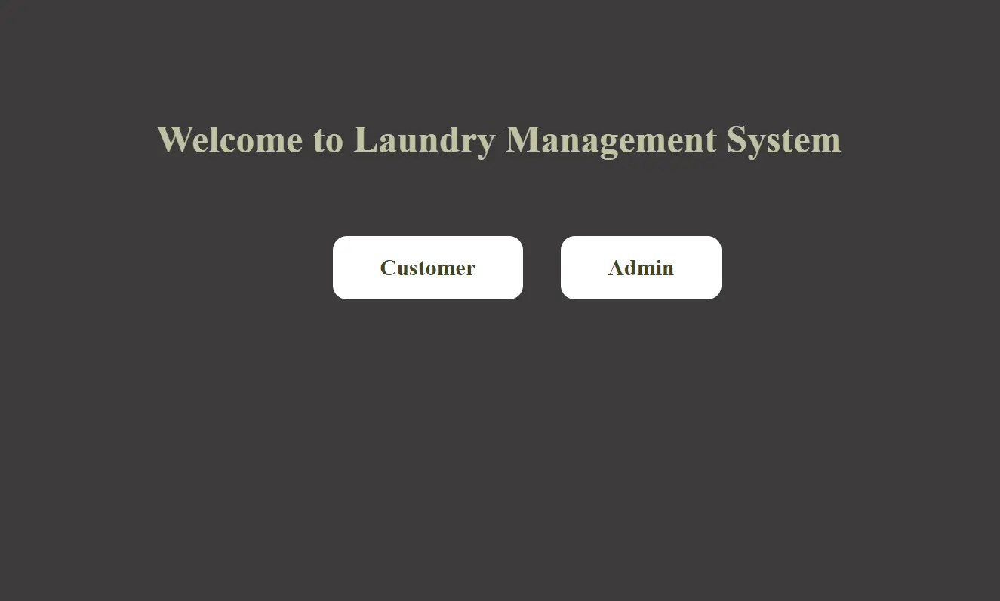

# LAUNDRY MANAGEMENT SYSTEM

It is a basic PHP project which includes usual database operations like INSERTION, DELETION, UPDATE. This project was done for DBMS mini project.

In order to start this web application first install XAMPP in your system.

And put this project folder inside XAMPP/htdocs/projects folder.

In my project structure there is **_laundry_management_system.sql_** file, download that file and import in your phpmyadmin panel. You'll get the whole database of this project.

Go to browser and type: "localhost/projects" and then you can click on project name that you've created. Initial page of this project is index.php is then loaded onto your browser.  

## SOME SNAPSHOTS OF THE PROJECT

This is home page

